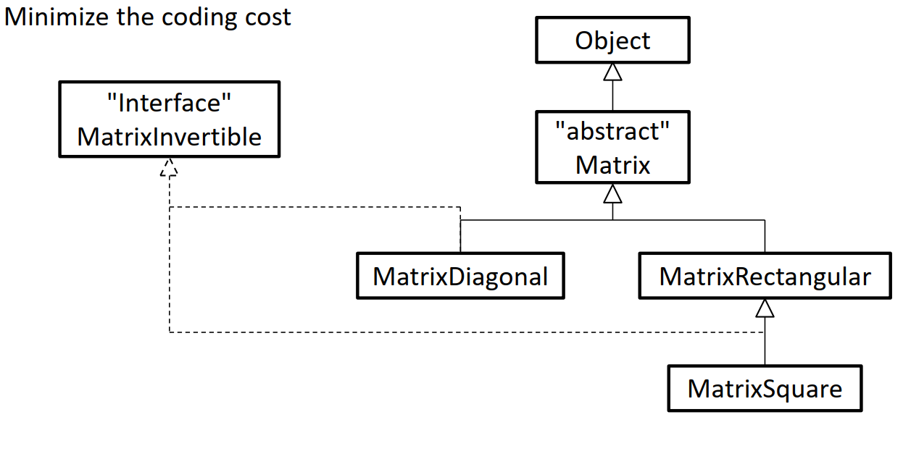

# Project manipulation de matrices
*Matagrin Noé et Pauly Armand*

L’objectif de ce projet est de créer un ensemble de classes et d’interfaces héritant les unes des autres sur le langage de programmation Java afin de pouvoir manipuler des matrices diagonales, rectangulaires et carrés. Nous avons choisi ce langage pour sa rigueur, sa robustesse et sa fiabilité ainsi que pour sa programmation orientée objet.

Dans ce projet, nous avons réalisé ce graphique :

À l’aide de différentes méthodes de la classe Matrix, nous pouvons ainsi accéder aux nombres de lignes et colonnes de ces différentes matrices grâce aux méthodes getNumberOfRows et getNumberOfColumns.
On peut également accéder à chaque élément de ces matrices avec la méthode getElement puis changer la valeur d’un élément de ces matrices avec setElement ou encore transposer ces matrices avec "transpose".
Enfin, on peut utiliser la méthode toString pour afficher ces matrices.

L’interface MatrixInvertible, elle propose de vérifier si une matrice est inversible avec la méthode isInvertible. On peut également accéder au déterminant d’une matrice avec getDeterminant ou encore trouver l’inverse d’une matrice avec getInvert.

En cas d’erreur dans l’utilisation d’une méthode des exceptions sont prévues pour indiquer à l’utilisateur l’origine de son erreur et stopper le code.

Pour plus d’information merci de vous référer à la Javadoc du projet.
